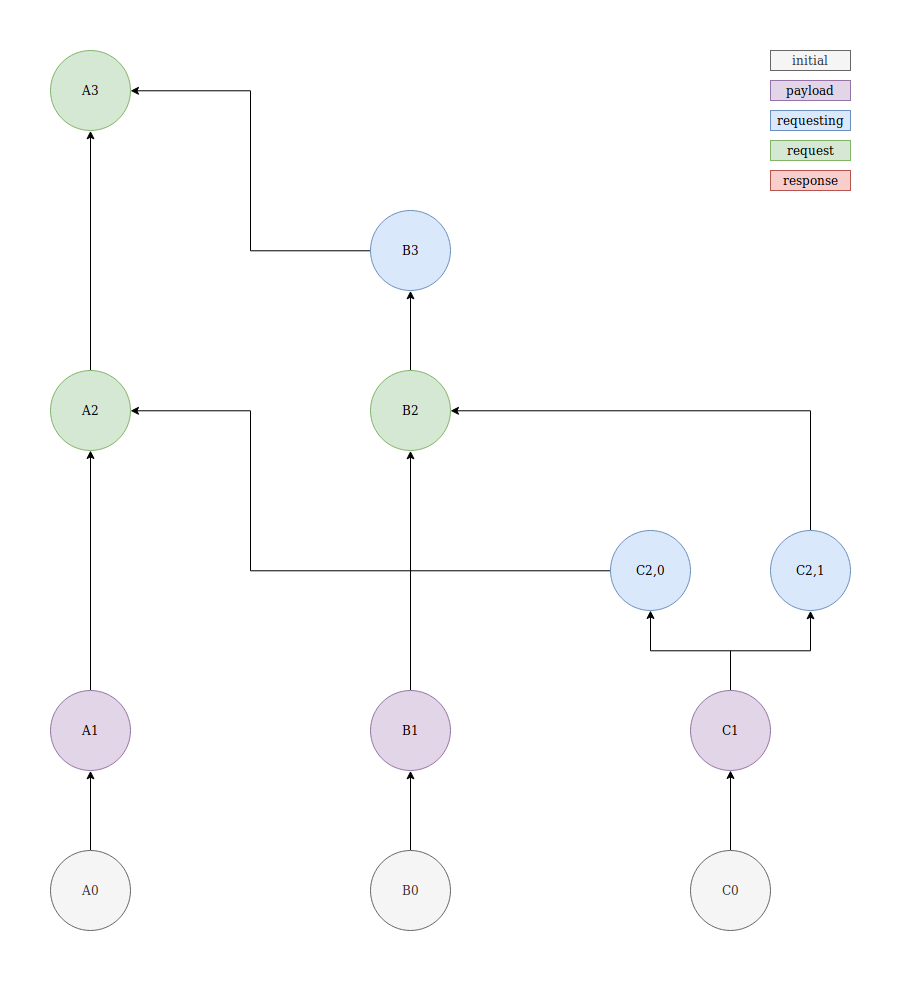
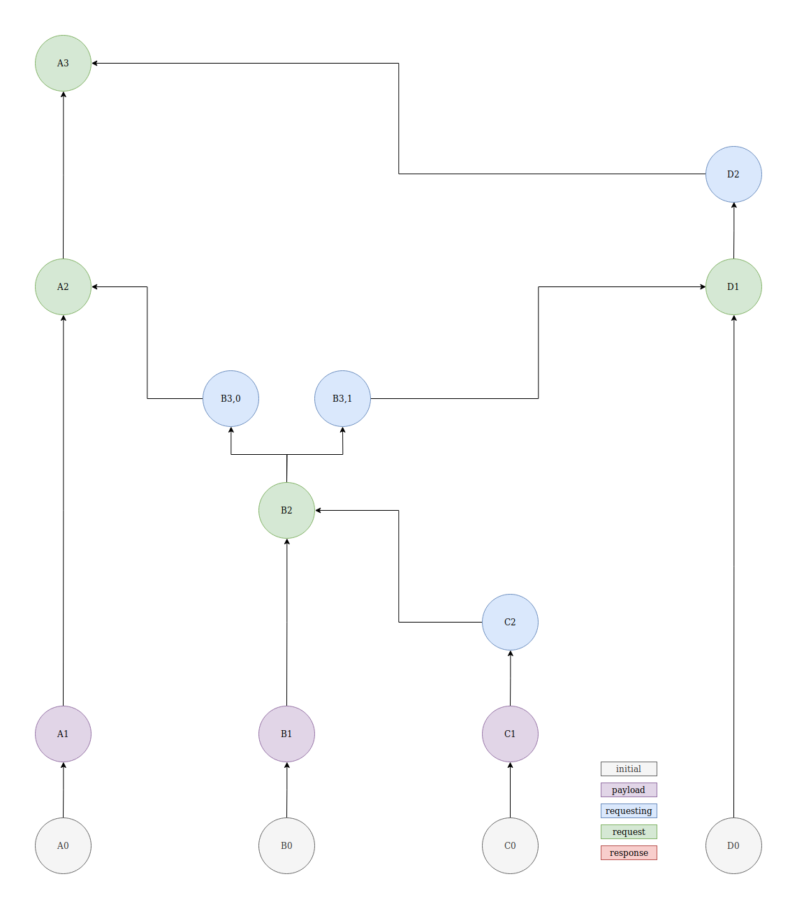

## `sees` and `is_descendant_of` relations in the presence of forks

### Simple fork

| X    | Y      | X is descendant of Y | X sees Y |
|:-----|:-------|:---------------------|:---------|
| `A2` | `C1`   | true                 | true     |
| `A2` | `C2,0` | true                 | true     |
| `A2` | `C2,1` | false                | false    |
| `A3` | `C1`   | true                 | false    |
| `A3` | `C2,0` | true                 | false\*  |
| `A3` | `C2,1` | true                 | false\*  |
| `B2` | `C1`   | true                 | true     |
| `B2` | `C2,0` | false                | false    |
| `B2` | `C2,1` | true                 | true     |

\* - although there is only one path between `A3` and `C2,0` / `C2,1`, `A3` is aware of the fork and so should not `see` either of them.

---

### Transitive fork

`A3` still `sees` `C2` even though there is a fork between them. This is because the fork is not created by the creator of `C2`.
